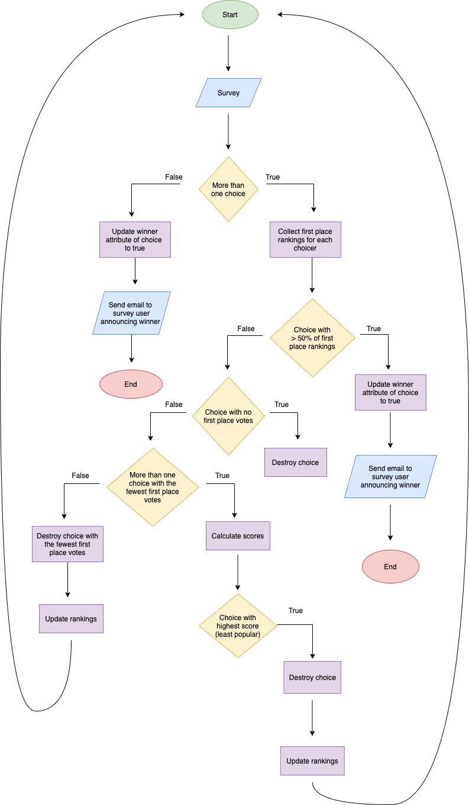

# README

**Ranked Choice Survey App**

This app allows users to create surveys that they want specific people to respond to; for example, you could survey members of your book club on what book they want to read next.  The app uses the principles of ranked choice voting to determine the winning choice.  (See flowchart at the bottom for the logic behind that process.)  The survey can include as many choices as the user desires. As part of survey creation, the user sets a threshold for the number of responses that must be received before the app calculates a winner.  The calculation can also be triggered by the user before the threshold is reached.  After the survey is created, the user uses the app to email the respondents a link to complete the survey.  The app also encrypts the respondent's email address into a token that the user includes in the email.  The respondent must put in the token and their email address when they fill out the response form.  For the response to be saved, the decrypted token must match the email address.  Tokens must also be unique.  These measures ensure that only responses from invited people are saved and they may only respond once. After the winner is calculated, the app emails the user to tell them which choice is the winner.

**Getting Started**

This app has a Rails backend that uses Ruby 2.7.0, Rails 6.0.3.6 and PostgreSql and a React frontend created with [Create React App](https://github.com/facebook/create-react-app) and styled with Bootstrap https://getbootstrap.com/. To work with this app on your machine, fork this frontend repo and the backend repo from https://github.com/flylady2/rcs2-backend and clone them down.  `cd` into the backend and run `bundle install`.  Make sure to have a Postgres server running. Then run `rake db:create` and `rake db:migrate` and start your rails server with the `rails s` command.  The rails server will automatically use port 3000 and the code in the front end assumes that it will.  In another pane of your terminal, `cd` into the frontend.  Use the command `npm start` to run the app in your browser, preferably Chrome.  The frontend server will inform you that port 3000 is being used and ask if you want it to use another port.  Reply yes.  Typically it wil use 3001.  Open [http://localhost:3001](http://localhost:3001) to view it in the browser.  Go to [http://localhost:3001/user/surveys](http://localhost:3001/user/surveys) to see links to the surveys you've created and to click a link to create a new survey.

**Contributing**

Bug reports and pull requests are welcome on GitHub at https://github.com/flylady2/rcs-2-backend or https://github.com/flylady2/rcs2-frontend. This project is intended to be a safe, welcoming space for collaboration, and contributors are expected to adhere to the Contributor Covenant code of conduct.

**License**

This app is available as open source under the terms of the [MIT License](https://opensource.org/licenses/MIT).

**Logic behind Ranked Choice Survey winner determination:**

